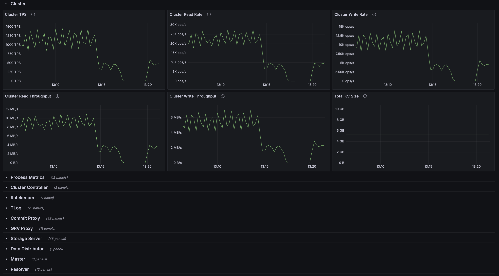

# FDB OTEL Exporter

The FDB OTEL exporter tails JSON FoundationDB logs and exposes OpenTelemetry-backed Prometheus metrics. This project also provides local Prometheus and Grafana containers for analyzing live or archived FDB logs. So far, the stack has been exercised on a small six-process cluster.

The Grafana dashboard has over 150 charts to visualize various FDB metrics:



## Why not use `status json`?

While relying solely on FDB logs prevents exposing some cluster-wide metrics that the cluster controller aggregates, the logs also contain many metrics not exposed through `status json`. For example, `Histogram` trace events give fine-grained details on latencies of FDB sub-operations, helpful for identifying bottlenecks. Furthermore, `status json` will give incomplete output if the cluster is in an unhealthy state, e.g. stuck in recovery. This means that useful metrics will be missing from `status json` precisely when it's most necessary to have visibility into the cluster's status. Not relying on `status json` also means that the `fdb-otel-exporter` crate has no dependency on the FDB client, though there is an implicit dependency on trace event schemas.

## Prerequisites

- Install Docker
- Set the required `FDB_LOG_DIR` environment variable to the location of your `trace.*.json` files generated by FDB processes. XML trace events are not supported.
- Export `GF_SECURITY_ADMIN_USER` and `GF_SECURITY_ADMIN_PASSWORD` with the Grafana admin credentials you want to use.

## Usage

Run:

```
docker compose up --build -d
```

Open `http://localhost:3000`, log in with the configured Grafana credentials, and navigate to the FDB Metrics dashboard. Prometheus is available at `http://localhost:9090`; the exporter exposes metrics at `http://localhost:9200/metrics`.

The container has separate health endpoints:

- `/health` reports process liveness.
- `/ready` reports readiness only after the log-directory watcher is running and its latest directory scan succeeded.

## Runtime Configuration

The exporter reads a handful of environment variables at startup:

- `LOG_DIR` (default `logs/`): directory containing `trace.*.json` files to tail.
- `LISTEN_ADDR` (default `0.0.0.0:9200`): socket address for the HTTP server that exposes `/metrics`, `/health`, and `/ready`.
- `TRACE_LOG_FILE` (default `logs/tracing.log`): prefix for exporter logs. Logs are also written to stdout; files rotate daily with seven files retained.
- `LOG_POLL_INTERVAL_SECS` (default `2`): frequency (in seconds) to rescan the log directory for new trace files.
- `GAUGE_CONFIG_PATH` (optional): runtime TOML configuration override. Without it, the exporter uses the validated configuration embedded at build time. The container sets this to `/app/gauge_config.toml`.

Existing trace files are read from the beginning. The exporter remembers the last complete line while running, resumes there after transient read errors, and detects truncation or same-path replacement. Offsets are not persisted across exporter restarts, so restarting intentionally rebuilds metrics from the currently visible trace files.

## Gauge Configuration

Reported metrics are configured in `gauge_config.toml`. Set `GAUGE_CONFIG_PATH` to load a modified file without rebuilding. Configuration is validated at startup, including section names, required fields, generated metric names, and duplicates. There are currently five metric mappings:

- `Simple`: Reports the numeric value of the field
- `CounterTotal`: Reports the total value from a counter (the third space-delimited value of the field)
- `CounterRate`: Reports the rate from a counter (the first space-delimited value of the field)
- `ElapsedRate`: Reports the numeric value of the field divided by the `Elapsed` field in the same trace event
- `HistogramPercentile`: Interpolates percentiles from histogram buckets aggregated by FDB, using geometric interpolation for power-of-two latency and byte buckets and linear interpolation for count buckets

For each gauge, the `trace_type`, `field_name`, `gauge_name`, and `description` must be configured. For example, the following gauge configuration:

```
[[counter_total_gauge]]
trace_type = "StorageMetrics"
gauge_name = "ss_bytes_input"
field_name = "BytesInput"
description = "Total input bytes on storage server"
```

will report a gauge from trace events of the form:
```
{ "Type": "StorageMetrics", "Time": "<trace_time>", "BytesInput": "<rate> <roughness> <total>", "Machine": "<process_address>", ... }
```

For histogram percentile gauges, the schema is different, and a list of percentiles are provided. For example:

```
[[histogram_percentile_gauge]]
group = "CommitProxy"
op = "TlogLogging"
percentiles = [0.5, 0.99, 0.999]
gauge_name = "cp_tlog_logging_latency"
description = "commit proxy TLog logging latency"
```

will report interpolated P50, P99, and P999 latency estimates from FDB trace events with `Type="Histogram"`, `Group="CommitProxy"`, and `Op="TlogLogging"`.

## Development

Run the same quality gates used by CI from `fdb-otel-exporter/`:

```bash
cargo fmt --all --check
cargo check --all-targets --all-features --locked
cargo clippy --all-targets --all-features --locked -- -D warnings
cargo test --all-targets --all-features --locked
cargo coverage-check
```

`cargo security-audit` runs the repository's scoped dependency audit after `cargo-audit` is installed. See [`fdb-otel-exporter/COVERAGE.md`](./fdb-otel-exporter/COVERAGE.md) for coverage and advisory details.

## Recommended Knob Overrides

These charts are most valuable with fine-grained latency metrics and histograms. To achieve this, apply the following knob overrides:

```
knob_latency_metrics_logging_interval = 10.0
knob_histogram_report_interval = 10.0
knob_kaio_latency_logging_interval = 10.0
```

Tracing these histograms frequently is relatively cheap for FDB, and the increased visibility from more frequent trace events generally outweighs any performance overhead.
