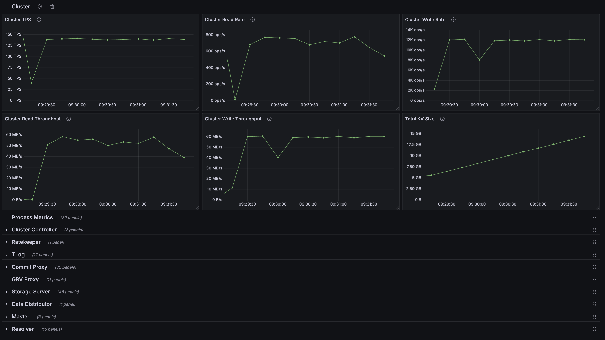

# FDB OTEL Exporter

The FDB OTEL exporter tails JSON FoundationDB logs and emits OTEL metrics. This project also sets up simple local Prometheus and Grafana containers for local analysis of FDB logs. So far, this project has only been tested locally on a small 6-process cluster running on a Mac.

The Grafana dashboard has over 100 charts to visualize various FDB metrics:



## Prerequisites

- Install Docker
- Set the `FDB_LOG_DIR` environment variable to the location of your `trace.*.json` logs files generated by FDB processes (note that XML trace events are not supported by this tool).
- Export `GF_SECURITY_ADMIN_USER` and `GF_SECURITY_ADMIN_PASSWORD` with the Grafana admin credentials you want to use.

## Usage

Run:

```
docker compose up --build -d
```

Open `localhost:3000` in your browser and login with the credentials provided in `GF_SECURITY_ADMIN_USER` / `GF_SECURITY_ADMIN_PASSWORD`. Then navigate in Grafana to the FDB Metrics dashboard to view FDB process metrics.

## Runtime Configuration

The exporter reads a handful of environment variables at startup:

- `LOG_DIR` (default `logs/`): directory to tail for `trace.*.json` files and to emit generated samples.
- `LISTEN_ADDR` (default `0.0.0.0:9200`): socket address for the HTTP server that exposes `/metrics` and `/health`.
- `TRACE_LOG_FILE` (default `logs/tracing.log`): path where structured logs from the exporter itself are written.
- `LOG_POLL_INTERVAL_SECS` (default `2`): frequency (in seconds) to rescan the log directory for new trace files.

## Gauge Configuration

Reported metrics are configured in the `gauge_config.toml` file. There are currently 5 types of gauges that can be reported from JSON trace files:

- `Simple`: Reports the numeric value of the field
- `CounterTotal`: Reports the total value from a counter (the third space-delimited value of the field)
- `CounterRate`: Reports the rate from a counter (the first space-delimited value of the field)
- `ElapsedRate`: Reports the numeric value of the field divided by the `Elapsed` field in the same trace event
- `HistogramPercentile`: Interpolates (assuming an exponential distribution) percentiles from histogram buckets aggregated by FDB

For each gauge, the `trace_type`, `field_name`, `gauge_name`, and `description` must be configured. For example, the following gauge configuration:

```
[[counter_total_gauge]]
trace_type = "StorageMetrics"
gauge_name = "ss_bytes_input"
field_name = "BytesInput"
description = "Total input bytes on storage server"
```

will report a gauge from trace events of the form:
```
{ "Type": "StorageMetrics", "Time": "<trace_time>", "BytesInput": "<rate> <roughness> <total>", "Machine": "<process_address>", ... }
```

For histogram percentile gauges, the schema is different, and a list of percentiles are provided. For example:

```
[[histogram_percentile_gauge]]
group = "CommitProxy"
op = "TlogLogging"
percentiles = [0.5, 0.99, 0.999]
gauge_name = "cp_tlog_logging_latency"
description = "commit proxy TLog logging latency"
```

will report interpolated P50, P99, and P999 latency estimates from FDB trace events with `Type="Hisogram"`, `Group="CommitProxy"`, and `Op="TlogLogging"`.

## Code Coverage

- The CI workflow publishes the latest `main` branch coverage report to GitHub Pages at [https://tclinken.github.io/fdb-otel-exporter/](https://tclinken.github.io/fdb-otel-exporter/); the landing page exposes the HTML report generated by `cargo llvm-cov`.
- For pull requests, the HTML publication is skipped, but the `coverage-lcov` artifact remains available from the workflow run for offline inspection.
